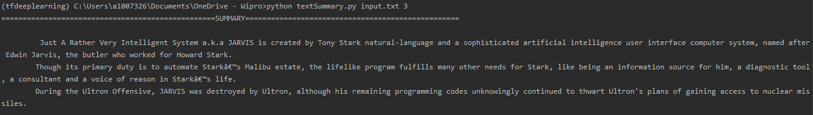
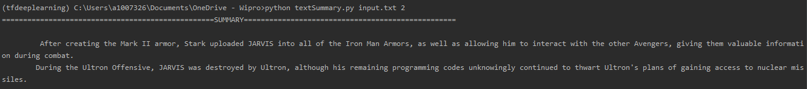

## assignment

Problem #6  Create a keyword filter :- keywordFilter.py

Steps:
  1. Run the keywordFilter.py with input.txt as an CLI argument.
  2. Give keyword as an input to find in the corpus.

Problem #4  Generate short summary from text-content :- textSummary.py

Steps:
  1. Run python textSummary.py [input_file] [length_of_summary]
  2. e.g. python textSummary.py input.txt 2
  3. 20% and 40% would be 2 and 4 as an argument of length of summary.

Result: python textSummay.py input.txt 3

  
  
  

Result: python textSummay.py input.txt 2

  

  

